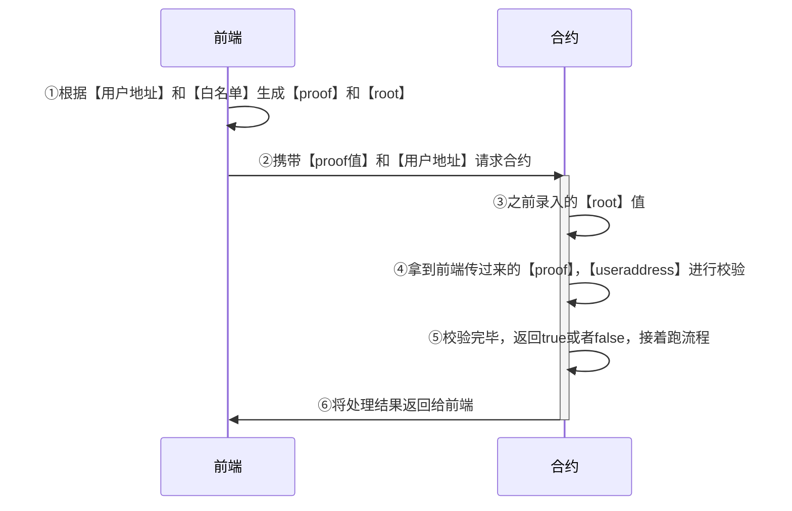

+++
title = 'Build NFT'
date = 2024-03-25T15:20:31+08:00
+++

## NFT metadata
NFT 有很多属性，名称（可能包括序列号）、描述、图片（包括音视频）、一些额外属性（在一些游戏的NFT中，可能有角色的力量值属性值等），那么这些属性都是怎么来的呢？
```json
{
  "name": "Hassan #1",
  "description": "Hassan Calloway is heir to Calloway Arms, one of the world's leading mil-tech suppliers. Ingenious and determined, Hassan has been searching for his missing father, and for SHRAP, since Earthfall.",
  "image": "https://raw.githubusercontent.com/kasoqian/HassanNFT/main/metadata/images/4.png",
  "attributes": [
    {
      "trait_type": "health",
      "value": "9"
    },
    {
      "trait_type": "power",
      "value": "68"
    },
    {
      "trait_type": "magic",
      "value": "16"
    },
    {
      "trait_type": "exp",
      "value": "93"
    },
    {
      "trait_type": "lv",
      "value": "R"
    }
  ]
}
```
这个 json 字符串就是 NFT 的元数据，其中包含 NFT 的名称、描述、图片、属性等。

除了 NFT 有这些属性，在 NFT 铸造合约还有着合约属性，即NFT集合属性
```json
{
  "name": "Kitaro World",
  "description": "Kitaro World is a collaborative community storytelling experience.",
  "image": "https://img1.baidu.com/it/u=1624676498,3671459173&fm=253&fmt=auto&app=138&f=JPEG?w=667&h=500",
  "external_link": "baidu.com",
  "seller_fee_basis_points": 1000, 
  "fee_recipient": "0xDc8611873fab19209f8845714a02eD17e287aB7C"
}
```
metadata 具体可以参考[metadata](https://docs.opensea.io/docs/metadata-standards)

## NFT mint
一个 NFT 合约本质就是两个映射，一个是 tokenId 到 tokenURI（上文提到的json元数据的链接） 的映射，另一个是 address 到 tokenId 的映射。

前者指定了一个 NFT 的元数据，后者是该 NFT 的拥有者。

```solidity
// SPDX-License-Identifier: MIT
pragma solidity ^0.8.20;

import "@openzeppelin/contracts/token/ERC721/extensions/ERC721URIStorage.sol";
import "@openzeppelin/contracts/utils/Counters.sol";

contract MerkleTreeWhiteList is ERC721URIStorage {
    using Counters for Counters.Counter;
    Counters.Counter private _tokenIds;

    constructor() ERC721("SmartDog", "dog") {}

    function safeMint(address to, string memory tokenURI) public returns (uint256) {
        // 生成 tokenId, 一个tokenId 唯一指定一个 NFT
        uint256 tokenId = _tokenIds.current();
        // 映射 tokenId 和 address
        _mint(to,tokenId);
        // 映射 tokenId 和 tokenURI
        _setTokenURI(tokenId,tokenURI);

        _tokenIds.increment();
        return tokenId;
    }

}
```
这样我们就完成了一个 NFT 的 mint。

## 白名单
白名单就是 NFT 铸造合约中，只有白名单中的地址可以 mint NFT。
一个简单的白名单一个map就可以实现。
```solidity
// SPDX-License-Identifier: MIT
pragma solidity ^0.8.20;

import "@openzeppelin/contracts/token/ERC721/extensions/ERC721URIStorage.sol";
import "@openzeppelin/contracts/utils/Counters.sol";

contract MerkleTreeWhiteList is ERC721URIStorage {
    using Counters for Counters.Counter;
    Counters.Counter private _tokenIds;

    mapping(address => bool) public whiteLists;

    constructor() ERC721("SmartDog", "dog") {}

    // 录入白名单
    function setWhiteLists(address _userAddress,bool _whiteState) public {
        whiteLists[_userAddress] = _whiteState;
    }

    function safeMint(address to, string memory tokenURI) public returns (uint256) {
        // 放心白名单address
        require(whiteLists[to], "Not whiteLists");
        // 生成 tokenId, 一个tokenId 唯一指定一个 NFT
        uint256 tokenId = _tokenIds.current();
        // 映射 tokenId 和 address
        _mint(to,tokenId);
        // 映射 tokenId 和 tokenURI
        _setTokenURI(tokenId,tokenURI);

        _tokenIds.increment();
        return tokenId;
    }

}
```
不过这种录入白名单方式花费的手续费过于高了，即使是把入参改成地址数组，也没有节省多少手续费。

## NFT Merkle Tree 白名单
gas 费和什么有关呢?简单的理解就是合约的复杂度和数据的复杂度，当我们的 mapping 不断增长时 gas 费会攀升!那我们的解决方法就出来了:
+ 降低数据复杂度; 
+ 降低合约复杂度;

merkle tree 通过对一组庞大的数据进行解析，生成唯一hash，然后通过少量的参数校验用户地址是否在白名单里，从而实现从大量变成少量的数据操作，也就实现了省 gas 费。
如何通过 merkle tree 校验白名单?
核心需要3个数据
+ root，由大量的白名单生成的一个 hash 值 
+ proof，一个数组，辅助验证的节点树 
+ userAddress，用户的地址


```solidity
// SPDX-License-Identifier: MIT
pragma solidity ^0.8.4;

import "@openzeppelin/contracts/token/ERC721/ERC721.sol";
import "@openzeppelin/contracts/access/Ownable.sol";
import "@openzeppelin/contracts/utils/Counters.sol";
// openzeppelin 提供的校验工具
import "@openzeppelin/contracts/utils/cryptography/MerkleProof.sol";

contract MerkleTreeWhiteList is ERC721, Ownable {
    using Counters for Counters.Counter;

    // 保存 MerkleProof 生成的白名单
    bytes32 public root;

    Counters.Counter private _tokenIdCounter;

    constructor(bytes32 _root) ERC721("MerkleTreeWhiteList", "MTWL") {
        // deploy 时候传入 Merkle Root
        root = _root;
    }
    
    // 校验方法，传入两个数据，proof = 证明数据、lear = 地址
    function isValid(bytes32[] memory proof, bytes32 leaf) public view returns (bool) {
        // 返回是否验证成功
        return MerkleProof.verify(proof, root, leaf);
    }
    
    function safeMint(address to, bytes32[] memory proof) public onlyOwner {
      // 校验 msg.sender 是否在白名单
        require(isValid(proof, keccak256(abi.encodePacked(msg.sender))), "Not a part of Allowlist");
        uint256 tokenId = _tokenIdCounter.current();
        _tokenIdCounter.increment();
        _safeMint(to, tokenId);
    }

    function setRoot(bytes32 _root) public onlyOwner {
        root = _root;
    }

}
```

## 付费 mint 和 提现
核心点：
+ address payable 当传入地址前加上了payable，此时该账号即可接收代币。
+ function f() payable 当调用方法上加了 payable，此时该方法可以接收代币。

转账监听：
当合约接收到 ETH 时，将触发以下两种回调其中一个。
+ receive，当msg.data不存在时;
+ fallback，当 msg.data 存在时。

转账核心有3种方式 addr.transfer, addr.send,addr.call，其中 addr.call为迭代后新增的方法，建议仅使用 addr.call，作为唯一转账方法。
```solidity
//SPDX-License-Identifier:MIT
pragma solidity ^0.8.4;

contract Transfer{

    string public name = "kasoqian";//监听反馈
    string public name2 = "kasoqian";//监听反馈

    //构建时可携带token存入
    constructor() payable{}

    //收到eth事件，记录amount和gas
    event Log(uint amount,uint gas);
    event fallbackCalled(address sender,uint amount,bytes data);

    //监听，接收eth，data不为空时被触发
    receive() external payable{
        name = "receive listener is working!!!";
        emit Log(msg.value,gasleft());
    }

    //监听，接收eth，data为空时被触发
    fallback() external payable{
        name2 = "fallback listener is working!!!";
        emit fallbackCalled(msg.sender,msg.value,msg.data);
    }

    // 查余额
    function getBalance() view public returns(uint){
        return address(this).balance;
    }

    // 转账
    function transferETH(address payable reciver, uint256 amount)external payable{
        //1.reciver.call{value:amount}("6666666");将会返回bool，data此处用=接收转账返回的bool值
        //2.666为本次交易的补充信息，可以要可不要
        //3.此处amount单位为wei
        (bool success,)= reciver.call{value:amount}("");
        //若不成功则报错
        require(success,"Contract execution Failed");
    }
}
```

具体到我们的 NFT 合约
```solidity
// SPDX-License-Identifier: MIT
pragma solidity ^0.8.20;

import "@openzeppelin/contracts/token/ERC721/extensions/ERC721URIStorage.sol";
import "@openzeppelin/contracts/utils/Counters.sol";

contract MerkleTreeWhiteList is ERC721URIStorage {
    using Counters for Counters.Counter;
    Counters.Counter private _tokenIds;

    constructor() ERC721("SmartDog", "dog") {}

  
    // 加入 payable ，合约账户就能接收金额了
    function safeMint(address to, string memory tokenURI) public payable  returns (uint256) {
        require(msg.value >= 1 ether,"eth not enough!");
        uint256 tokenId = _tokenIds.current();
        _mint(to,tokenId);
        _setTokenURI(tokenId,tokenURI);

        _tokenIds.increment();
        return tokenId;
    }

    // 加入 payable ，被修饰的账户就能转账了
    function withdraw(address payable owner) public  {
        (bool success,)= owner.call{value: address(this).balance}("");
    }

}
```

## 如何生成简单的合约随机数
[合约](https://learnblockchain.cn/article/858)

预言机 chainLink

[视频课](https://www.bilibili.com/video/BV1K3411F71T/?spm_id_from=333.788&vd_source=c4008368635b99f44772f6036fb116b7)

